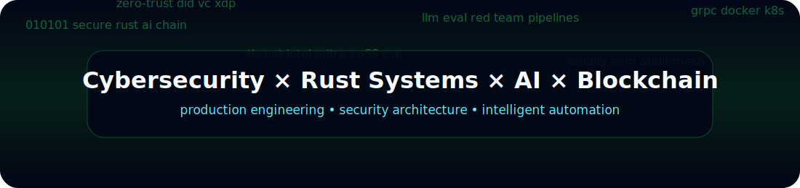
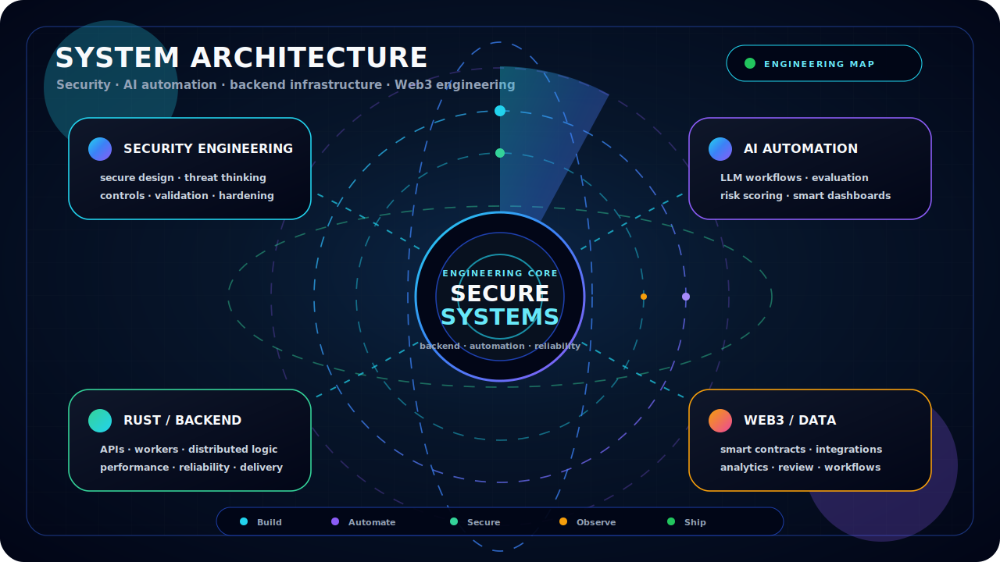

 

---

## ⚡ Positioning

> I build **secure, intelligent, distributed systems** across cybersecurity, Rust infrastructure, AI automation, and blockchain protocols.

I focus on production-grade engineering: systems that are secure by design, observable, automated, scalable, and useful in real environments.

---

## 🧠 Engineering Identity

<table>
<tr>
<td width="50%">

### 🔐 Security Engineering
- Cybersecurity engineering and secure software design
- VAPT, threat modeling, and risk visibility
- MITRE ATT&CK mapping
- Vulnerability research and bug bounty work
- IDS/IPS, endpoint, and network security awareness
- Security reporting and engineering ownership

</td>
<td width="50%">

### 🦀 Rust / Backend Systems
- Async Rust backend services
- REST and gRPC APIs
- Distributed system components
- Backend reliability and performance
- Infrastructure-oriented services
- Production-focused engineering

</td>
</tr>
<tr>
<td width="50%">

### 🤖 AI Systems
- LLM evaluation and red-teaming
- Prompt engineering
- AI risk scoring dashboards
- Anomaly detection
- Threat prediction workflows
- Dataset quality review

</td>
<td width="50%">

### ⛓️ Blockchain / Web3
- Solidity smart contracts
- EVM-compatible systems
- Smart-contract security practices
- On-chain analytics
- DeFi, dApp testing, and gas optimization
- Ethereum, BNB Chain, Polygon, Solana, and Monad exposure

</td>
</tr>
</table>

---

## 🛰️ System Map

  

---

## 🛠️ Tech Stack

### Languages

### Backend / Systems

### Infrastructure / DevOps

### Security Engineering

### AI / ML

### Blockchain / Web3

---

## 🚀 Proof-of-Work Matrix

| Direction | Stack | Proof Signal |
|---|---|---|
| **Security Software Engineering** | Rust, Python, security tooling | Secure systems, risk visibility, engineering ownership |
| **AI Systems Engineering** | Python, LLM evaluation, AI workflows | Model testing, prompt engineering, AI product feedback |
| **Rust Backend Infrastructure** | Rust, REST/gRPC, distributed systems | Reliability, performance, backend architecture |
| **Blockchain Engineering** | Solidity, EVM, Rust backend | Smart contracts, Web3 systems, security-first design |
| **DevOps / Platform Delivery** | Linux, Docker, Kubernetes, CI/CD, cloud | Production delivery, automation, monitoring |
| **Client-Facing Product Work** | Flutter, dashboards, APIs | Usable security and AI tooling |

---

## 📊 Engineering Capability Map

  

---

## 🐍 Contribution Flow

  

---

## 🧊 Contribution Graph

  

---

## 🎯 Open To Roles

---

## 🤝 Connect

---

**Secure by design. Built for production. Optimized for impact.**

